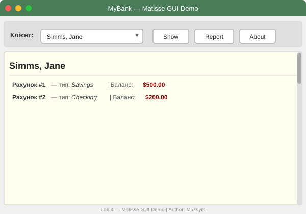

# Lab 4 — Matisse GUI для банківської системи MyBank

**Автор:** Maksym  
**Курс:** Об'єктно-орієнтоване програмування (Java)  
**Тема:** Створення GUI за допомогою Netbeans Swing GUI Builder (Matisse)

---

## Скріншот запущеної програми



---

## Опис проєкту

Цей проєкт демонструє створення графічного інтерфейсу (GUI) за допомогою **Netbeans Matisse** (Swing GUI Builder) для банківської системи **MyBank**.  
Компонування виконується через **GroupLayout** — макет, який автоматично генерує Matisse.

### Реалізовані функції

| Елемент | Опис |
|---|---|
| **JComboBox** | Список клієнтів банку (завантажуються з `test.dat`) |
| **Show** | Відображає всі рахунки обраного клієнта з типом і балансом |
| **Report** | Загальний звіт по всіх клієнтах + підсумковий баланс |
| **About** | Діалогове вікно `JOptionPane` з інформацією про програму |

---

## Структура проєкту

```
gui-2-Maksym860-master/
├── src/
│   └── com/mybank/gui/
│       └── MatisseDemo.java    ← головний файл GUI (GroupLayout / Matisse)
├── data/
│   └── test.dat                ← файл з даними клієнтів
├── jars/
│   └── MyBank.jar              ← бібліотека Bank, Customer, Account
├── Lab 4 - Matisse/
│   ├── Lab 4.md                ← умова завдання
│   └── GUI-Lab-4.PNG           ← прототип інтерфейсу
├── screenshot.svg              ← знімок екрану запущеної програми
├── build.gradle
└── README.md
```

---

## Формат файлу `test.dat`

```
4                        ← кількість клієнтів

Jane    Simms    2       ← ім'я, прізвище, кількість рахунків
S  500.00  0.05          ← Savings: баланс, відсоткова ставка
C  200.00  400.00        ← Checking: баланс, ліміт овердрафту

Owen    Bryant   1
C  200.00  0.00
...
```

**Типи рахунків:**
- `S` — SavingsAccount (ощадний): баланс + відсоткова ставка
- `C` — CheckingAccount (чековий): баланс + ліміт овердрафту

---

## Як запустити

### Варіант 1 — через NetBeans (рекомендований)

1. `File` → `Open Project` → оберіть папку `gui-2-Maksym860-master`
2. Правою кнопкою на проєкті → `Properties` → `Libraries` → `Add JAR/Folder` → `jars/MyBank.jar`
3. Переконайтесь, що `MatisseDemo.java` знаходиться у пакеті `com.mybank.gui`
4. `Run Project` (F6)

### Варіант 2 — через командний рядок

```bash
# Компіляція (Linux/macOS)
javac -cp jars/MyBank.jar src/com/mybank/gui/MatisseDemo.java -d out/

# Запуск (з кореня проєкту)
java -cp "out/:jars/MyBank.jar" com.mybank.gui.MatisseDemo
```

> **Windows:** замініть `:` на `;` у classpath

---

## Виконані завдання

- ✅ **На «3»** — GUI форма з елементами керування (JComboBox, кнопки Show / Report / About)
- ✅ **На «4»** — читання з `test.dat`, Show показує всі рахунки, About через `JOptionPane`
- ✅ **На «5»** — кнопка Report з повним звітом і загальним балансом по всіх клієнтах
